<div align="center">



<br />


<br /><br />

[](https://rajkumarg.vercel.app)
[](https://linkedin.com/in/rajkumarg-aspiringdata)
[](https://leetcode.com/u/Rajkumar_57/)
[](https://codeforces.com/profile/g.p.rajkumar5)
[](mailto:g.p.rajkumar5@gmail.com)

</div>

---

## About

```python
class RajkumarG:
    role = "AI / ML Engineer | Data Scientist"
    education = "B.Tech, Artificial Intelligence & Data Science (2026)"
    focus = ["NLP", "Computer Vision", "LLMs", "RAG", "MLOps"]
    currently = "Turning research ideas into reliable, production-ready systems."
```

I build AI systems that are practical, measurable, and ready to deploy—from retrieval-augmented agents and ML pipelines to computer-vision inspection workflows.

## Highlights

| Experience | Selected outcomes |
| --- | --- |
| **DVS Advisory Group** | LLM agents and RAG for tax and transfer-pricing automation |
| **CloudCouch** | ML pipelines, AI agents, FastAPI, and Docker deployments |
| **Poclain Hydraulics** | Computer-vision inspection system: 40% faster process and 30% fewer errors |
| **Research & recognition** | Patent filed · Springer and Wiley published · National Hackathon winner |

## Selected work

| Project | What it does | Stack |
| --- | --- | --- |
| **VibeCheckHQ** | Real-time social-media intelligence and sentiment analytics | Python · LLaMA · BERT · RoBERTa · Flask · WebSocket |
| **AnnotAIte** | Active-learning data-labeling workflow that reduces manual effort | PyTorch · YOLO · Flask |
| **BookPopInsights** | Market intelligence for book trends across 10,000+ listings | Python · Selenium · Power BI · Scikit-learn |

## Skills

`Python` `SQL` `Java` `PyTorch` `TensorFlow` `Scikit-learn` `LLMs` `RAG` `LangChain` `FastAPI` `Docker` `MLflow` `GCP` `Power BI`

## Live developer snapshot

<div align="center">

<sub>Live data is supplied by each service and refreshes automatically. Card requests use a short cache to keep the view current without making the README slow.</sub>

<br /><br />

<a href="https://github.com/Rajkumar5723">
  
</a>
<a href="https://github.com/Rajkumar5723">
  
</a>

<br />

<a href="https://codeforces.com/profile/g.p.rajkumar5">
  
</a>

<br />

<a href="https://github.com/Rajkumar5723">
  
</a>

</div>

---

<div align="center">

Open to collaborations, research opportunities, hackathons, and full-time roles in 2026.

<i>“I don't just train models. I build systems that think.”</i>

</div>
